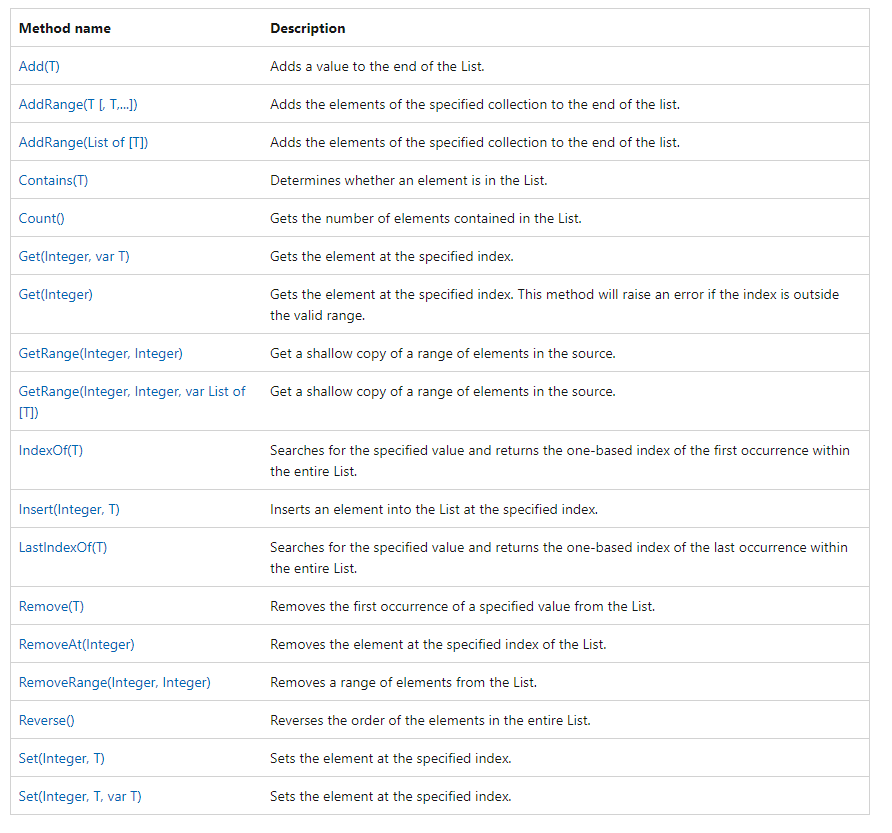
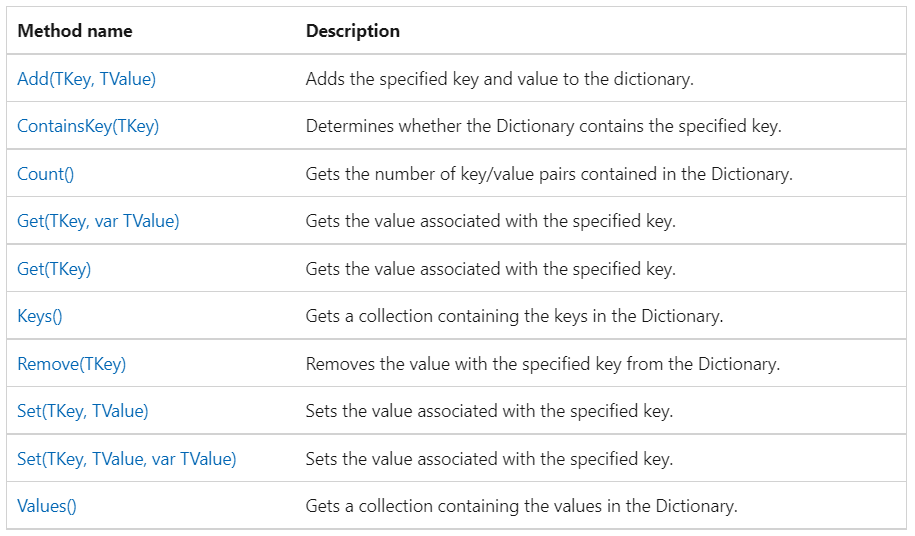

/*************
# Lists
Represents a strongly typed list of ordered objects that can be accessed by index. Contrary to the Array data type, a List is unbounded, such that its dimension does
 not need to be specified upon declaration.
**Its strongly typed cause it a type of argument when defining it i.e list of[DataType] but not all data types

** Given a string of recipients, we can create a list by using the ‘Split’ method
**Then we can loop through each recipient to get the individual emails. After that, for example, we can create individual emails for them, store the values where needed, etc.

**The ‘IndexOf’ method returns the index of a certain value in the list. So we can use it to get the values stored previously with ‘Split’

************/

# Dictionaries
/*************
What Is A Dictionary In Business Central?

** A dictionary is an object type that represents a collection of keys and values. You can think of it as a two-field table where the first field is the key, and the second field is the value:

** The key is unique and can be any data type, including text, numbers, and dates.
** Dictionaries work together with lists. They work together because when you need to retrieve the keys of a dictionary, the keys are actually a list.

*************/  

# Array

/*************
** An array is a collection of values of the same data type stored in contiguous memory locations. It
** is a data structure that allows you to store multiple values in a single variable.
# Element − Each item stored in an array is called an element.
# Index − Each location of an element in an array has a numerical index, which is used to identify the element. The index starts from 0 and goes up to n-1, where n is the number of
# The CopyArray Method
* *CopyArray is used to copy elements of one array to another.
            * * Syntax: Copyarray:=CopyArray(Newname,ArrayName,Position[,Length]);

*************/